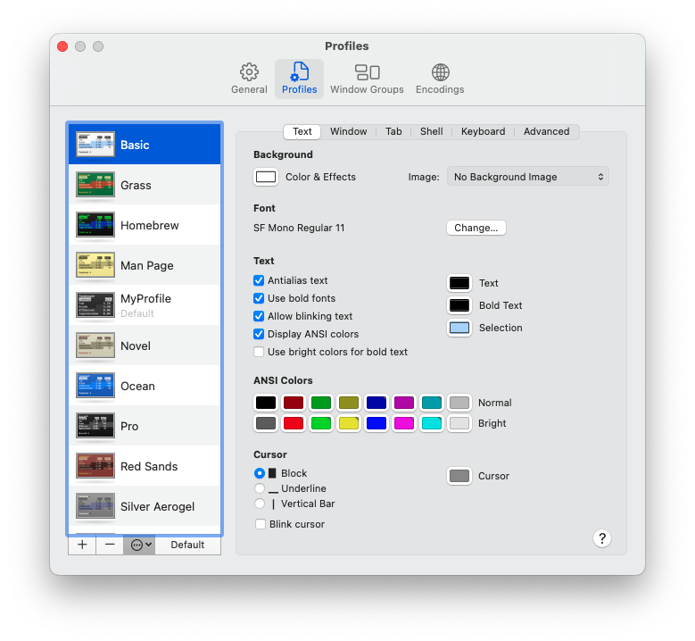

# My macOS Setup

## System Settings

1. Open Terminal and run `pwpolicy -clearaccountpolicies`
2. Siri > Disable
3. Desktop & Dock > Default Web Browser: Arc
4. Lock Screen > Start Screen Saver when inactive: For 5 minutes
5. Lock Screen > Turn display off on battery when inactive: For 5 minutes
6. Lock Screen > Turn display off on power adapter when inactive: For 20 minutes
7. Lock Screen > Require password after screen...: After 5 minutes
8. Keyboard > Keyboard Shortcuts... > Launchpad & Dock > Show Launchpad: off
9. Keyboard > Keyboard Shortcuts... > Spotlight > Show Spotlight search: off
10. Keyboard > Keyboard Shortcuts... > Spotlight > Show Finder search window: off
11. Keyboard > Keyboard Shortcuts... > Function Keys > Use F1, F2, etc. keys as standard function keys: on
12. Mouse > Point & Click > Tracking speed: Maximum
13. Mouse > Point & Click > Natural scrolling: off
14. Mouse > Point & Click > Secondary click: Click Right Side
15. Mouse > Point & Click > Smart zoom: on
16. Mouse > More Gestures > Swipe between pages: off
17. Mouse > More Gestures > Swipe between full-screen applications: on
18. Mouse > More Gestures > Mission Control: on
19. Trackpad > Point & Click > Tracking speed: 6
20. Trackpad > Point & Click > Look up & data detectors: Force Click with One Finger
21. Trackpad > Point & Click > Secondary click: Click or Tap with Two Fingers
22. Trackpad > Point & Click > Tap to click: on
23. Trackpad > Scroll & Zoom > Natural scrolling: off
24. Trackpad > Scroll & Zoom > Zoom in or out: on
25. Trackpad > Scroll & Zoom > Smart zoom: on
26. Trackpad > Scroll & Zoom > Rotate: on
27. Trackpad > More Gestures > Swipe between pages: Scroll Left or Right with Two Fingers
28. Trackpad > More Gestures > Swipe between full-screen apps: Swipe Left or Right with Three Fingers
29. Trackpad > More Gestures > Notification Center: on
30. Trackpad > More Gestures > Mission Control: Swipe Up with Three Fingers
31. Trackpad > More Gestures > App Exposé: Swipe Down with Three Fingers
32. Trackpad > More Gestures > Launchpad: on
33. Trackpad > More Gestures > Show Desktop: on
34. Users & Groups > Change Password...

## Configure Terminal

1. Open Terminal
2. Go to Terminal > Settings... > Profiles > Three dots > Import...



3. Select `./config_files/MyProfile.terminal`
4. Go to Terminal > Settings... > General
    1. On Startup, open: New window with profile: MyProfile
    2. Shell opens with: Default login shell
    3. New windows open with: Default Profile; Default Working Directory
    4. New tabs open with: Same Profile; Same Working Directory

### Configure `zsh`

1. Configure visuals:

```bash
mkdir $HOME/.zsh
cp zsh/functions.sh $HOME/.zsh/functions.sh
cp zsh/prompt.sh $HOME/.zsh/prompt.sh
cp zsh/.zshrc $HOME/.zshrc
```

2. Set config files:

```bash
cp config_files/.gitconfig $HOME/.gitconfig
cp config_files/.gitauthors $HOME/.gitauthors
cp config_files/.gitignore $HOME/.gitignore
cp config_files/.npmrc $HOME/.npmrc
```

3. Configure PATH

```bash
sudo sh -c 'cat /etc/paths > /etc/paths.d/10-apple'
sudo sh -c 'echo "" > /etc/paths'
sudo sh -c 'echo "/opt/homebrew/bin" > /etc/paths.d/01-homebrew'
sudo sh -c 'echo "/opt/homebrew/sbin" >> /etc/paths.d/01-homebrew'
```

## Install Applications

```bash
# Prerequisites
brew install mas

# Must-have appps
brew install --cask 1password
brew install --cask arc
brew install --cask docker
brew install --cask iina
brew install --cask jetbrains-toolbox
brew install --cask motrix
brew install --cask notion
brew install --cask spotify
brew install --cask utm
brew install --cask visual-studio-code

# Utilities
brew install --cask hiddenbar
brew install --cask raycast
brew install --cask the-unarchiver

# Other apps
brew install --cask adobe-creative-cloud
brew install --cask discord
brew install --cask dropbox
mas install 462058435 # Microsoft Excel
mas install 462062816 # Microsoft PowerPoint
mas install 462054704 # Microsoft Word
brew install --cask whatsapp
brew install --cask wireshark
brew install --cask zoom
```

## Install Terminal Packages

1. Basic packages

```bash
brew install ffmpeg
brew install jaq
brew install maven
brew install postgresql@15
brew install tree
brew install watch
```

2. Python

```bash
brew install pyenv
echo '# Pyenv Initialization' >> ~/.zshrc
echo 'export PYENV_ROOT="$HOME/.pyenv"' >> ~/.zshrc
echo '[[ -d $PYENV_ROOT/bin ]] && export PATH="$PYENV_ROOT/bin:$PATH"' >> ~/.zshrc
echo 'eval "$(pyenv init -)"' >> ~/.zshrc

source ~/.zshrc
pyenv install 3.12
```

3. Node

```bash
curl -o- https://raw.githubusercontent.com/nvm-sh/nvm/v0.40.1/install.sh | bash

source ~/.zshrc
nvm install --lts

mkdir ~/.pnpm
mkdir ~/.pnpm/store
corepack enable pnpm
```

4. Other special packages

```bash
git clone https://github.com/alejofl/git-coauthor.git $HOME/.git-coauthor
sudo sh -c 'echo "$HOME/.git-coauthor" > /etc/paths.d/100-git-coauthor'

brew install --cask mactex-no-gui
sudo sh -c 'echo "/Library/TeX/texbin" > /etc/paths.d/100-tex'
```

## Configure Applications

### 1Password

* General
    * Keep 1Password in the menu bar
    * Click the icon to: Show Quick Access
    * Start at login
    * Format secure notes using Markdown
    * Default Vault > Save new items to: Rodrigo Flores's Family -> Private
    * Keyboard Shortcuts > Show 1Password: No shortcut
    * Keyboard Shortcuts > Show Quick Access: Option + Command + \
    * Keyboard Shortcuts > Lock 1Password: No shortcut
    * Keyboard Shortcuts > Autofill: Command + \
* Security
    * Unlock > Confirm my account password: Every 30 days
    * Auto-lock > Lock after computer is idle for: Never

### Visual Studio Code

#### Extensions

* Bottom Terminal (Fuad Pashayev)
* C/C++ Extension Pack (Microsoft) (Extension Pack)
* CMake (twxs)
* Docker (Microsoft)
* gettext (MrOrz)
* GitHub Copilot (GitHub)
* GitHub Copilot Chat (GitHub)
* GitHub Markdown Preview (Matt Bierner) (Extension Pack)
* Hex Editor (Microsoft)
* Jupyter (Microsoft) (Extension Pack)
* Live Server (Ritwick Dey)
* Live Share (Microsoft)
* Markdown GitHub Alerts (saeris)
* One Dark Pro (binaryify)
* Pylance (Microsoft)
* Python Debugger (Microsoft)
* Python Extension Pack (Don Jayamanne) (Extension Pack)
* Rainbow CSV (mechatroner)
* Swagger Viewer (Arjun G)
* x86 and x86_64 Assembly (13xforever)
* YAML (Red Hat)

#### Settings

* Text Editor
    * Editor: Font Size: 16
    * Accessibility Support: off
* Workbench
    * Color Theme: One Dark Pro Darker
* Extensions > One Dark Pro
    * Markdown Style: Toggle Markdown style: Uncheck

### Raycast

#### Extensions

* Calendar: off
* Coffee
* Color Picker
    * Color Names
    * Convert Color
    * Generate Colors
    * Pick Color
* Define Word: off
* Developer: off
* Download Video
* Lorem Ipsum
* Quicklinks > Search DuckDuckGo: off
* Raycast AI: off
* Raycast Settings: off
* Raycast for Teams: off
* Search Contacts: off
* Shortcuts: off
* Translate: off
* Window Management
    * Almost Maximize -> Hotkey: Control + Option + Arrow Up
    * Center -> Hotkey: Control + Option + C
    * Maximize -> Hotkey: Control + Option + Enter
    * Next Display -> Hotkey: Control + Option + Arrow Right
    * Previous Display -> Hotkey: Control + Option + Arrow Left
* ray.so
    * Generate Image

#### Settings

* Startup > Launch Raycast at login: Checked
* Raycast Hotkey: F10

